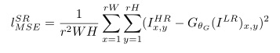

这篇论文第一次将GAN（生成式对抗网络）引入图像超分辨率，取得state-of-art的效果，论文的效果值得称赞！

<!--more-->

论文是2016.09.15发布在arXiv上，作者栏上Twitter很是显眼，低头看了一眼还在显示娱乐八卦的微博，反手就是一巴掌…

### 综述
这篇论文摘要中说，最近的图像超分辨率的工作大都集中于以均方差（MSE）作为损失函数，这样会造成生成图像过于平滑，缺少高频细节，看起来很不爽，所以提出了基于生成式对抗网络的网络结构，据我们所知这是生成式对抗网络第一次应用于4倍下采样图像的超分辨重建（无形装逼，最为致命）。本文提出了一个由adversarial loss和content loss组成的损失函数，损失函数作为GAN的判别器损失函数来对生成图像进行判别。多说一句，我们的损失函数是基于感知相似性而不是像素空间的相似性（不要用信噪比（PSNR）那种东西来衡量我的论文），所以我们的生成图像的质量非常好。
### 主要贡献 
论文刚开始不出所料的对各路大神在超分辨率的工作进行无情嘲讽，就按下不表了，主要说说贡献。这边文章最大的贡献是将生成式对抗网络应用于图像超分辨率，让判别器分辨生成的图像和真实的图像，这样就能达到photo-realistic的效果，这个想法不错，然后设计了一个新的损失函数进行判别我们接下来会详细的说明一下。
#### 对抗式生成网络结构
生成式对抗网络我们就不详细说了，感兴趣的同学们可以去看下一以Goodfellow为首的众大神的一系列文章

在这篇论文中的GAN生成器式这么描述的:`At the core of our very deep generator network G,which is illustrated in Figure are B residual blocks with identical layout. Sepecifically, we use two convolutional layers with small 3x3 kernels and 64 feature maps followed by batch-normalization layers and ReLU as the activation fuction. We increase the resolution of the input image with two trained deconvolution layers.`原文是这样大家也能看得懂，不翻译了,大概就是**残差块+卷积层+BN层+ReLU**，对于GAN的判别器就是**VGG+LeakyReLU+max-pooling**,具体结构如图。

#### “感知”损失函数

感知损失函数的也是本文巨大创新点之一，大概就是不从像素层面判断生成图像的质量好不好，而是从观感的角度来判别，由判别器来判别。感知函数由两个部分组成：
1. Content Loss
2. Adversarial Loss

公式分别如下：

组合体公式如下：

公式背后的数学意义大概就是**MSE+GAN**，每个占一定部分的权重，分别表示空间的相似性、判别器看到的相似性。具体的公式细节大家自行感受一下。
### 展望未来
当然，论文最后展望了一下未来，认为PSNR并不能代表生成图像的质量（毕竟这篇文章的得分不是很高[坏笑]），我们要找一个更好的衡量方法！但是从实验结果来看，确实这样，人的感官不能单靠信噪比来表示，数学意义上的相似并不代表感官上的相似。我们还要把网络做的更深你怕不怕，我们还要找更好的损失函数你怕不怕。

在论文后面放出实验结果

最后

***LOVE AND PEACE***

更新：
https://arxiv.org/abs/1609.04802 论文地址，我写完才发现这篇论文在2017年5月又提交了一版，删除了正则化的损失函数，其实本来正则化的系数就很小，我把正文也修改了，Twitter你这个善变的社交网站。