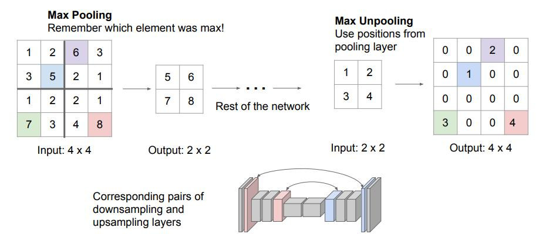
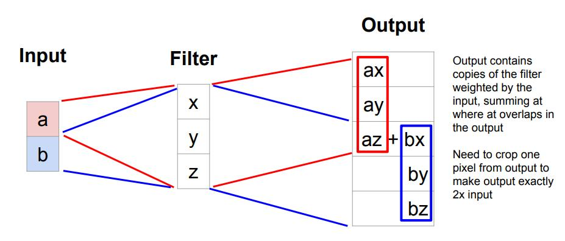

Deconv和Unpooling作为标准操作却很少被人提及

<!--more-->

在深度学习分类检测等任务中，大部分操作都是在下采样(downsampling)，因为我们输入高维的图像，然后输出是低维的坐标信息或者是分类信息，所以我们需要下采样来减少维度，但是在一些特殊的任务中，比如生成或者是语义分割的时候，我们最终的维度跟输入的图像维度相同甚至要更大，所以我们需要一些上采样(upsampling)的操作，Deconv和Unpool就是这样的操作，能够增加维度信息，达到升维的效果。

# Unpooling

Unpooling作为一种上采样的方法，与pooling看起来像是相反的操作，我们有三种方法，第一种是Nearest Neighbor，就是把相同的数据复制４个达到扩大四倍的效果，第二种是"Bed of Nails"，把数据防止在对应位置的左上角，然后其余的地方补0，如下图所示。

第三种方法是Max Unpooling，对于一部分网络模型来讲，上采样和下采样的结构往往是对称的，我们可以在下采样做Max Pooling的时候记录下来最大值所在的位置，当做上采样的时候把最大值还原到其对应的位置，然后其余的位置补0,如下图所示。

这样可以最大限度的还原信息。

# Deconv

对于Deconv这个名字，学界一直是有争议的。现在我们用的更多的是__Transpose Convolution__.　Deconv听起来像是卷积的逆，但是实际上并不是，这里只是一个上采样的方法，用的基础操作还是卷积，用一个例子说明，我们想要把一个2x2的输入上采样至4x4，如下图所示。

我们仍用3x3的卷积核，值得注意的是，我们在输入的时候做了stride=2，所以我们的输出扩大了2倍，我们可以很清楚的计算出宽高，在3x3的例子里面经过Transpose Convolution的这九个数就是，输入的一个数分别乘以卷积核，输出重叠的部分相加。我们用一维的例子来说明更清楚。

相互重叠的地方就sum，这就是为什么我们用Deconv这个操作做生成模型的时候，生成出来的图像会有棋盘格效应，为了解决这个问题，近期一部分学者通过设置卷积核的大小和步长来规避掉重叠部分，也不失为一种方法。

所以为什么说Transpose Convolution这个名字更合适呢？在caffe中，我们不去设计一个滑动的卷积核，而是通过将数据扩展为一维向量，卷积核扩展为一个大矩阵，直接做矩阵乘法来获得输出，这样在GPU中可以最大限度的加速，而Transpose Convolution的操作就是把卷积核的大矩阵做上下左右翻转，然后再左乘输入向量，所以说被称为Transpose Convolution更为合适。详细的证明再此不在复述，有兴趣的同学可以查一下相关资料。

