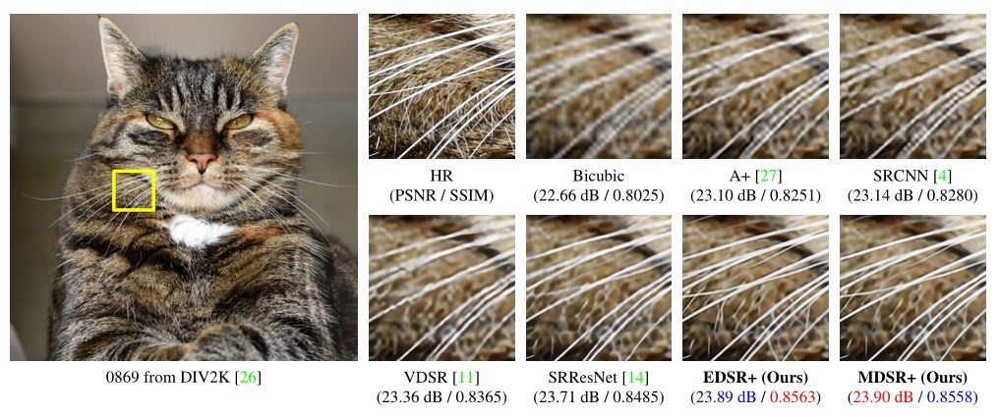

	---
title: 【读论文】EDSR
date: 2017-10-20 20:00:00
tags:
  - paper
  - Super-resolution
categories: 读论文
toc: true

---
让我们跟上时代的节奏，看一下来自思密达的一篇赢得了NTIRE2017超分辨率挑战赛第一名的论文。

<!--more-->

这篇论文名字很耿直，叫《增强深度残差网络单幅图像超分辨率》，言简意赅，跟外面的妖艳贱货根本不一样好伐。我们直接放出来实验结果（论文中的）来看一下这篇代表了目前最棒效果的论文怎么样。

还是很震撼的有木有，喵的胡须丝丝分明，放大4倍后的效果很震惊，这到底是怎么做到的？

看一下摘要，超分辨率最近的研究已经进入深度卷积神经网络（DCNN）的时代，残差网络表现尤为出色，我们在这篇文章中提出了一个增强超分辨率网络（EDSR），达到了state-of-the-art的效果。我们的模型表现如此优秀是由于我们**移除了在卷积残差网络中一些不必要的模块**,并且我们**扩大了模型尺寸**以便于进行稳定的训练。

对于目前盛行的一些深度神经网络结构
