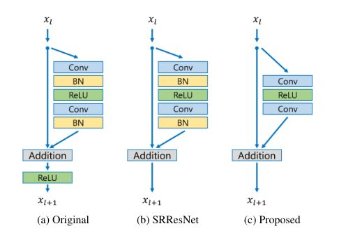
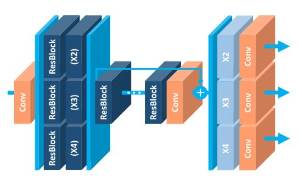

	---
title: 【读论文】EDSR
date: 2017-10-20 20:00:00
tags:
  - paper
  - Super-resolution
categories: 读论文
toc: true

---
让我们跟上时代的节奏，看一下来自思密达的一篇赢得了NTIRE2017超分辨率挑战赛第一名的论文。

<!--more-->

这篇论文名字很耿直，叫《增强深度残差网络单幅图像超分辨率》，言简意赅，跟外面的妖艳贱货根本不一样好伐。我们直接放出来实验结果（论文中的）来看一下这篇代表了目前最棒效果的论文怎么样。

还是很震撼的有木有，喵的胡须丝丝分明，放大4倍后的效果很震惊，这到底是怎么做到的？
## 摘要
看一下摘要，超分辨率最近的研究已经进入深度卷积神经网络（DCNN）的时代，残差网络表现尤为出色，我们在这篇文章中提出了一个增强超分辨率网络（EDSR），达到了state-of-the-art的效果。我们的模型表现如此优秀是由于我们**移除了在卷积残差网络中一些不必要的模块**,并且我们**扩大了模型尺寸**以便于进行稳定的训练。
## 提出方法
近期的一些深度神经网络模型在信噪比指标上有很好的表现，然而这样的神经网络有很多问题，首先超分辨率重建效果对网络架构非常敏感，一些细小的变化对最终的结果产生了很大的影响，并且同一个网络架构在初始化和训练技术上不同最终会产生不同的结果，不太稳定，其次对于不同尺度的超分辨率问题之间没有进行联系，其实不同尺度的超分辨率重建之间有很多的关系。后来我们发现SRResNet节省了训练的时间和内存并且有着不俗的表现，我们决定搞一下残差网络（ResNet），原始的残差网络用于解决图像分类啊，检测啊这些高层的计算机视觉问题，因此，残差结构应用于涉及到像素这种底层问题并不适用，但是我们就是要搞。我们分析了一下残差网络，然后去除掉了一部分不需要的结构，简化了网络结构，然后小心翼翼的炼丹，最后果然发现练出了更好的效果，以至于取得了NTIRE 2017超分辨率挑战的第一第二名。接下来看我们是怎么做的。

### 残差块 (Residual blocks)
像SRResNet已经将残差网络用于超分辨率了，我们还是改进了一下。

我们去掉了BN层（batch normalization layers），这个层吧，在分类问题中很好用，但是在超分辨率问题中真的并没有什么卵用，去掉它我们节省了**40%**的内存（相较于SRResNet），然后我们就可以用这部分内存构建一个更大的模型来得到更好的表现，毕竟我们的计算资源有限。

### 单尺度模型（Single-scale model）

增强网络模型表现最简单的方法就是**增加神经网络的参数**。在卷积神经网络中可以通过堆叠更多的卷积层和滤波器个数，但是我们发现随着特征图（feature maps）的增加，神经网络的训练会变得很不稳定，于是我们想用残差不就完了么，什么,SRResNet用过了？我们去掉一个激活函数层！（写到这儿，我只有一个表情[白眼]），并且我们用了一个提前训练的网络层作为起始状态，而不是随机初始化，我们得到了一个很好的表现结果（写到这儿，我只有一个表情[????]，fine-tune当然快啊！！），我不想放论文的图了，这图是单纯的凑数啊。

我还是放出来给大家看一下吧。

### 多尺度模型（Multi-scale model）
fine-tune会提高最终的结果，我们想这是为什么呢，莫不是提前训练（pretrained）的模型与当前模型之间有什么关系？既然他们有一些说不清楚的关系，我们把他们放在一起好了，于是我们提出了一个多尺度的模型，他们**共享中间的残差块的参数**，这样我们对于不同的尺度（也就是放大倍数）就不用单独的构建网络模型了，节省了很多的参数（谁来告诉我这是什么逻辑）。

没错就是这个样纸，我们把三个模型合成了一个，然后共用了一部分参数（这是什么啊，摔！）。

## 总结
实验过程咱就不说了，就是一些网络模型参数和训练参数，这篇论文看下来最大的贡献就是**通过实验证明了BN层在超分辨率问题上没有用**，但是这也能写篇论文？？！！当然，思密达也意识到了这个问题，于是他们加了很多废话。整篇论文就是这样，至于为什么去掉BN层效果就会提高很多呢？神经网络大黑盒，谁又说的清楚。

最后附上论文地址：
https://arxiv.org/pdf/1707.02921v1.pdf

**LOVE AND PEACE**