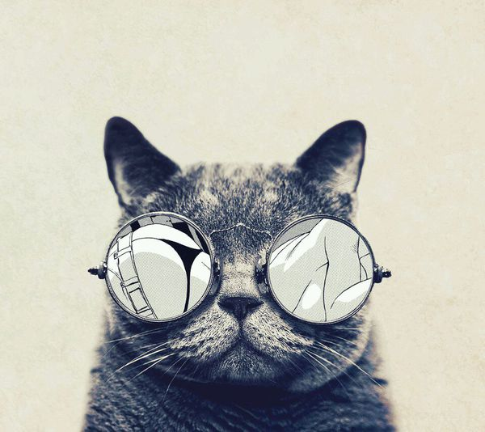

  在markdown文件中插入图片是一件巨麻烦无比的事情，特别是在图片很多的情况下，先把图片上传到服务器，再把图片的链接贴在markdown文件中，这个过程可以吃下三个月饼、两个香蕉，经过寻找，终于发现了一个快捷、方便、好的不行的插入图片方法，直接在本地添加。

<!--more-->
1.首先在站点目录下的`_config.yml`中是否存在`post_asset_folder: `这句话，把冒号之后的`false`改为`true`，hexo默认的参数是`false`。

2.在blog文件夹下执行
```
npm install https://github.com/CodeFalling/hexo-asset-image --save
```
默默的等它跑完。

3.接下来就可以正常的开始新建一个文章：`hexo new 文章名字`,你发现在    `/source/_posts/` 目录下会出现一个新的md文件和一个同名的文件夹，图片就可以放在这个文件夹的下面。
```
/name
    1.jpg
    2.jpg
    3.jpg
name.md
```

4.在文章中只要使用``既可以插入图片，[]中的logo是图片的名字。


这样做的好处是方便，不好的地方是图片**真的很占地方**，所以酌情使用。

插一张图片试试效果

